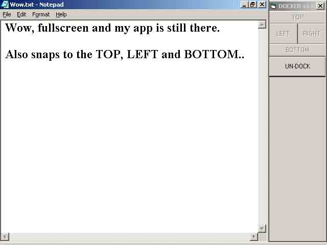

<div align="center">

## Snap you app to the side of the screen \(like ICQ does\.\. Resizing desktop\.\. not just moving the form\)


</div>

### Description

This code uses the SystemParametersInfo API to change the work space area of the desktop. You can make you app 'lock' to either top/bottom/left or right of the screen very simply.
 
### More Info
 
This example does not move all the other windows like ICQ does, they will change when you maximize them but I think the only other way to do it would be to do a EnumWindows then send WM_MOVE to each window visible.. I think that is how ICQ moves all the windows out of the way


<span>             |<span>
---                |---
**Submitted On**   |
**By**             |[SKoW](https://github.com/Planet-Source-Code/PSCIndex/blob/master/ByAuthor/skow.md)
**Level**          |Intermediate
**User Rating**    |5.0 (25 globes from 5 users)
**Compatibility**  |VB 6\.0
**Category**       |[Windows API Call/ Explanation](https://github.com/Planet-Source-Code/PSCIndex/blob/master/ByCategory/windows-api-call-explanation__1-39.md)
**World**          |[Visual Basic](https://github.com/Planet-Source-Code/PSCIndex/blob/master/ByWorld/visual-basic.md)
**Archive File**   |[](https://github.com/Planet-Source-Code/skow-snap-you-app-to-the-side-of-the-screen-like-icq-does-resizing-desktop-not-just-moving__1-14562/archive/master.zip)

### API Declarations

```
Private Declare Function SystemParametersInfo Lib "user32.dll" Alias "SystemParametersInfoA" (ByVal uAction As Long, ByVal uiParam As Long, pvParam As Any, ByVal fWinIni As Long) As Long
Enum DockTypes
    DockLeft = 1
    DockTop = 2
    DockRight = 3
    DockBottom = 4
End Enum
Private Type vbRECT   ' use this to save old Window Positions
    vbLeft As Long
    vbTop As Long
    vbWidth As Long
    vbHeight As Long
End Type
Private Type RECT
    Left As Long
    Top As Long
    Right As Long
    Bottom As Long
End Type
Private Const SPIF_SENDWININICHANGE = &H2
Private Const SPI_GETWORKAREA = 48
Private Const SPI_SETWORKAREA = 47
Private vbFormOldRect  As vbRECT
Private LastDock    As DockTypes
Private DockAmount   As Integer
```


### Source Code

```

Sub UnDockForm(vbForm As Form)
' This sub does the opposite of DockForm basicly.
Dim Desktop As RECT
' Get the Work space area of the desktop
SystemParametersInfo SPI_GETWORKAREA, 0&, Desktop, 0&
With Desktop    ' change the values back to normal
  Select Case LastDock
    Case DockBottom
      .Bottom = .Bottom + DockAmount
    Case DockLeft
      .Left = .Left - DockAmount
    Case DockTop
      .Top = .Top - DockAmount
    Case DockRight
      .Right = .Right + DockAmount
    Case Else
      Exit Sub ' no dock performed
   End Select
End With
' Now set the form back to normal
With vbFormOldRect
    vbForm.Move .vbLeft, .vbTop, .vbWidth, .vbHeight
End With
' Now, update the SystemParams again..
 SystemParametersInfo SPI_SETWORKAREA, 0&, Desktop, SPIF_SENDWININICHANGE
' And clear LastDock
LastDock = 0
' And thats it. Should all be good =]
End Sub
Sub DockForm(vbForm As Form, DockPos As DockTypes)
' Notes     - YOU *MUST* run UnDock before closing program
'         otherwise the desktop will remain 'clipped'
If LastDock <> 0 Then
  ' form is already docked... you really don't want to dock it somewhere else
  MsgBox "Please don't re-dock without un-docking.", vbOKOnly, "Docking aborted"
  Exit Sub
End If
' FIRST, save the RECT of vbForm
With vbFormOldRect
  .vbHeight = vbForm.Height
  .vbLeft = vbForm.Left
  .vbTop = vbForm.Top
  .vbWidth = vbForm.Width
End With
Dim Desktop As RECT
'Get the Current Desktop Work Area
SystemParametersInfo SPI_GETWORKAREA, 0&, Desktop, 0&
' Now, resize the form to what we want it to be
Dim V As vbRECT
V = vbFormOldRect    ' (aka current window size)
With V
  Select Case DockPos
    Case DockLeft
      .vbTop = (Desktop.Top * 15)
      .vbLeft = (Desktop.Left * 15)
      .vbHeight = (Desktop.Bottom * 15) - .vbTop
    Case DockRight
      .vbTop = (Desktop.Top * 15)
      .vbLeft = (Desktop.Right * 15) - .vbWidth
      .vbHeight = (Desktop.Bottom * 15) - .vbTop
    Case DockBottom
      .vbTop = (Desktop.Bottom * 15) - .vbHeight
      .vbLeft = (Desktop.Left * 15)
      .vbWidth = (Desktop.Right * 15) - .vbLeft
    Case DockTop
      .vbTop = (Desktop.Top * 15)
      .vbLeft = (Desktop.Left * 15)
      .vbWidth = (Desktop.Right * 15) - .vbLeft
    Case Else
      Exit Sub
  End Select
End With
' Now, Modify the Desktop values
With Desktop
  Select Case DockPos
    Case DockBottom
      DockAmount = (vbForm.Height / 15)
      .Bottom = .Bottom - DockAmount
    Case DockRight
      DockAmount = (vbForm.Width / 15)
      .Right = .Right - DockAmount
    Case DockTop
      DockAmount = (vbForm.Height / 15)
      .Top = .Top + DockAmount
    Case DockLeft
      DockAmount = (vbForm.Width / 15)
      .Left = .Left + DockAmount
  End Select
End With
' Now all is needed is to Update the sysParams..
SystemParametersInfo SPI_SETWORKAREA, 0&, Desktop, SPIF_SENDWININICHANGE
' Note: SPIF_SENDWININICHANGE saves us from using
'  SendMessage HWND_BROADCAST, WM_SETTINGSCHANGE, SPI_SETWORKAREA, Desktop
'  to update all the windows.
With V
  vbForm.Move .vbLeft, .vbTop, .vbWidth, .vbHeight
End With
' Cool, and it's that simple. Now set the LastDock variable for UnDock.
LastDock = DockPos
End Sub
```

